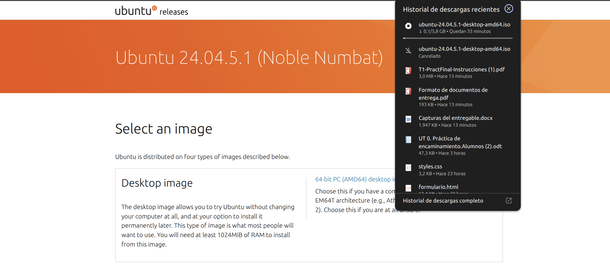
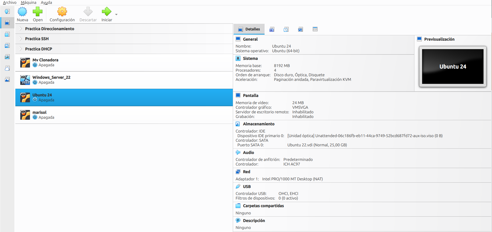

# 0. Qué he analizado

Esta guía sale del análisis de todo el material de Linux de ASIR: scripts de Bash, ficheros de usuarios y prácticas de sistemas.

## 0.1 Archivos de Linux revisados

| Unidad | Archivo | Qué hace |
| :--- | :--- | :--- |
| UD3 | `script2.sh` | Número negativo, cero o positivo (`if/elif`). |
| UD3 | `script3.sh` | Par o impar (` módulo %`). |
| UD3 | `script4.sh` | Aprobado o suspenso según la nota. |
| UD5 | `script-usuarios-DRV.sh` | Crea usuarios en masa leyendo `usuarios.csv`. |

::: note
**Sobre credenciales y alertas:** en mis scripts no hay nada llamado así literalmente. Lo más parecido a credenciales es `chpasswd` y a alertas son los timers de systemd y códigos de error `$?`.
:::

# 1. Análisis de mis comandos

Esta parte está dividida por categorías. En cada tabla verás **la función del comando** y **el uso que le di en mis scripts**.

## 1.1 Elementos del propio shell

Esto es lo más que preguntan en un examen: no son programas externos, son la sintaxis del lenguaje.

```bash
#!/bin/bash
clear
function mostrarMenu(){ ... }
if [ $# -eq 1 ]; then
    if [ -f $1 ]; then
        if [ $UID -eq 0 ]; then
            opcion=1
            while [ $opcion -ne 0 ]
            do
                mostrarMenu
                read -p 'Opción: ' opcion
                case $opcion in
                    0) salir ;;
                    1) funcion1 ;;
                    *) echo 'Opción incorrecta' ;;
                esac
            done
        fi
    fi
fi
```

::: tip
**Regla de oro:** números $\rightarrow$ `-eq`, `-lt`, `-gt`; texto $\rightarrow$ `==`, `!=`. Espacios obligatorios dentro de los corchetes: `[ $a -eq 1 ]` funciona; `[$a -eq 1]` falla.
:::

## 1.2 Grid de Demostración de Fotos

Aquí probamos el nuevo sistema de rejilla eficiente para fotos:

::: {.grid cols=2}


:::

# 2. Guía rápida de bucles en Bash

Hay tres situaciones que debes distinguir. Cuando lo tienes claro, elegir el bucle es automático.

| Situación | Bucle |
| :--- | :--- |
| Repetir hasta que el usuario elija salir | `while [ condición ]` |
| Procesar un fichero línea a línea | `while IFS=sep read ... done < fichero` |
| Recorrer una lista, un rango o ficheros | `for ... in ...` |

::: warning
**Atención al examen:** si un script falla, comprueba por este orden: (1) ¿espacios dentro de `[ ]`? (2) ¿comillas simples vs. dobles? (3) ¿`do/done`, `then/fi`, `;;/esac` bien cerrados? (4) ¿variable bien escrita? (5) ¿`$?` leído justo tras el comando?
:::
